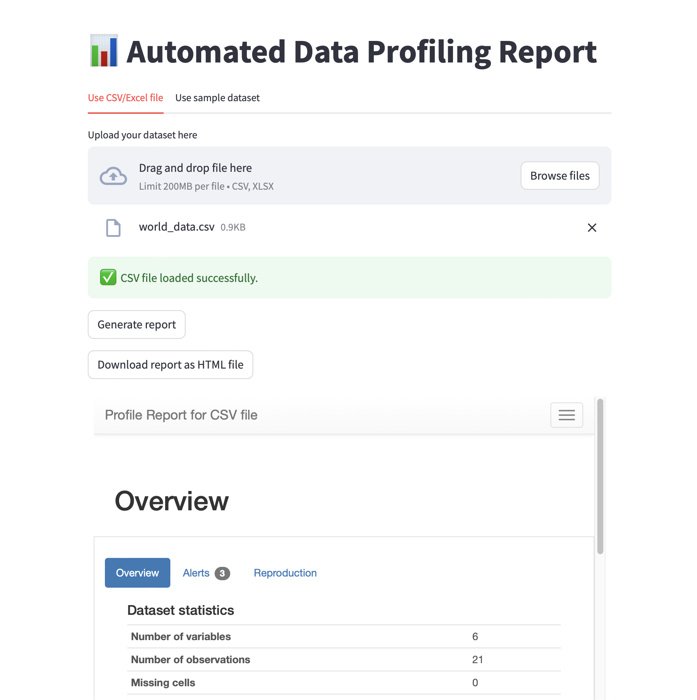
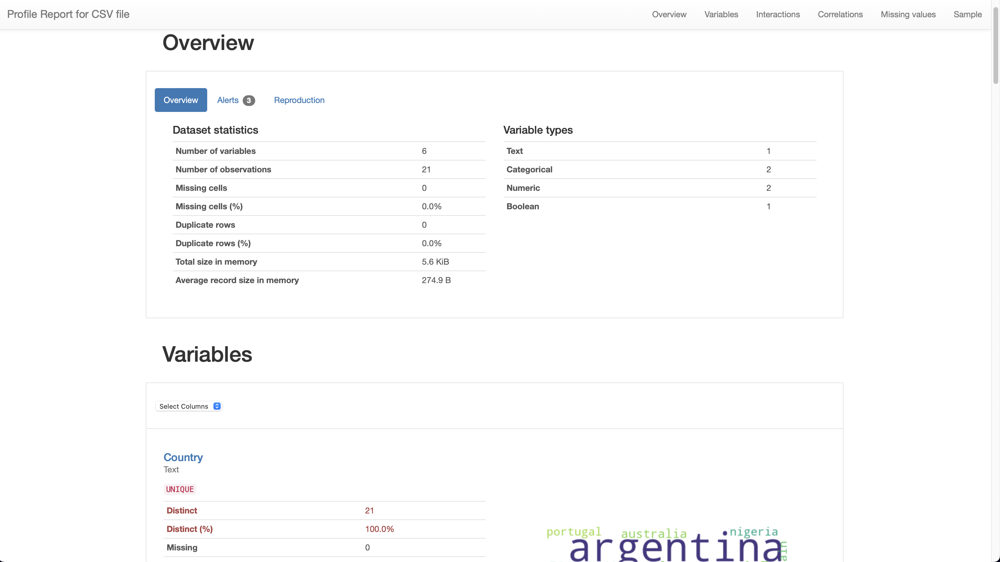
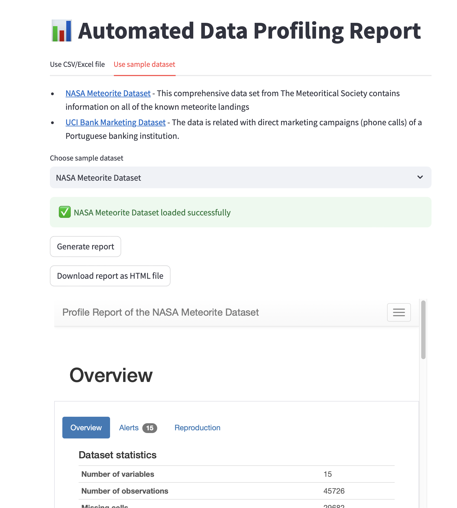

# Exploratory Data Analysis Projects

## ⚙️ Auto-EDA Application

### Motivation

As an initial step of the data science or analytics process, we are often required to build a basic understanding of the dataset that we're working with. Although there are many visualization tools as extensive as Tableau or Microsoft PowerBI, and as code-oritented as Python packages like matplotlib or seaborn, users often face a learning curve or varying degree. Users also do not have immediate access to a simple tool where they may upload their dataset files and a complete exploratory data analysis report may be generated. My application aims to tackle both of these issues through an easy interface.

### ﹖ How to run the application

Clone repostiory:

>```git clone https://github.com/abheeeshekdutta/eda.git```

Change to the correct directory:

>```cd auto-eda-app```

Install dependencies:

>```pip install requirements.txt```

Run the Streamlit application:

>```streamlit run app.py```

After running the above commands, the application will be available at http://localhost:8501

### 🛠️ Tools Used

1. Python - programming language used for building majority of the application
2. [Streamlit](https://streamlit.io) - to develop the application user interface
3. [Y-Data Profiling](https://ydata-profiling.ydata.ai/docs/master/) - Easy to use Auto-EDA library in Python

### 📸 Screenshots



<br><hr>



<br><hr>


